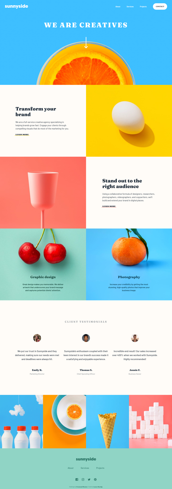
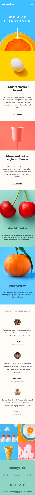
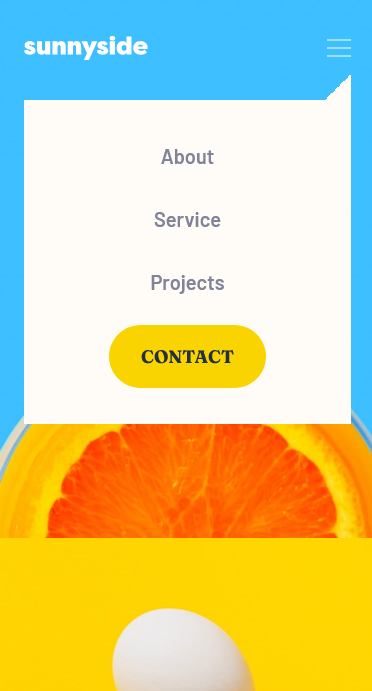

# Frontend Mentor - Sunnyside agency landing page solution

This is a solution to the [Sunnyside agency landing page challenge on Frontend Mentor](https://www.frontendmentor.io/challenges/sunnyside-agency-landing-page-7yVs3B6ef). Frontend Mentor challenges help you improve your coding skills by building realistic projects.

## Table of contents

- [Overview](#overview)
  - [The challenge](#the-challenge)
  - [Screenshot](#screenshot)
  - [Links](#links)
- [My process](#my-process)
  - [Built with](#built-with)
  - [What I learned](#what-i-learned)
  - [Continued development](#continued-development)
- [Author](#author)

**Note: Delete this note and update the table of contents based on what sections you keep.**

## Overview

### The challenge

Users should be able to:

- View the optimal layout for the site depending on their device's screen size
- See hover states for all interactive elements on the page

### Screenshot

### Links

- Solution URL: [Frontend Mentor Solution]()
- Live Site URL: [Sunnyside Agency Landing Page](https://lancemartija.github.io/SunnysideAgencyLandingPage/)

## My process

### Built with

- Semantic HTML5 markup
- CSS custom properties
- Flexbox
- CSS Grid
- Mobile-first workflow
- Dart Sass CSS Framework
- JavaScript

### What I learned

I learned that creating a landing page requires tons of planning. You can't just go and slap some grid properties and position absolutes when trying to position images and layouts. In the process of making this landing page, I understood how to break down the parts of a layout and try to create it bit by bit. I also learned how important it is to test you website on different types of browsers and viewports. Just because your website looks perfect on Google Chrome doesn't mean it looks the same on Firefox.

### Continued development

Creating websites with mobile-first workflow can be quite challenging at times. So, I would like to work on my skills when creating a responsive website.

## Author

- Website - [Lance Martija](https://github.com/lancemartija)
- Frontend Mentor - [@lancemartija](https://www.frontendmentor.io/profile/lancemartija)
- Twitter - [@lancemartija](https://www.twitter.com/lancemartija)